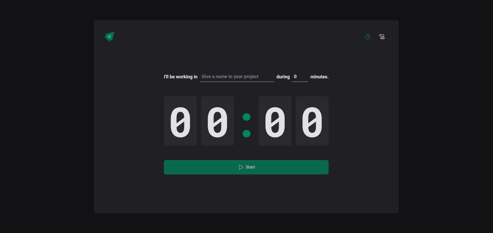
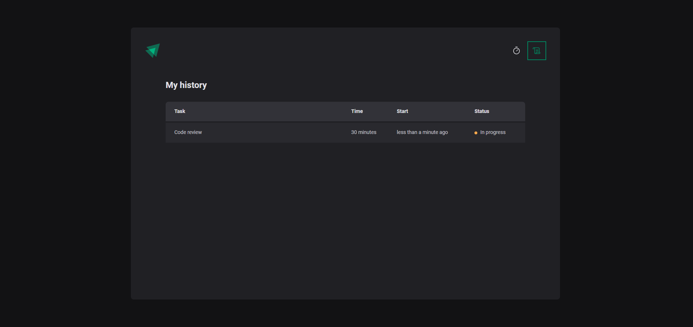

[VITE__BADGE]: https://img.shields.io/badge/Vite-B73BFE?style=for-the-badge&logo=vite&logoColor=FFD62E
[TYPESCRIPT__BADGE]: https://img.shields.io/badge/TypeScript-007ACC?style=for-the-badge&logo=typescript&logoColor=white
[REACT__BADGE]: https://img.shields.io/badge/React-20232A?style=for-the-badge&logo=react&logoColor=61DAFB
[REACT_ROUTER__BADGE]: https://img.shields.io/badge/React_Router-CA4245?style=for-the-badge&logo=react-router&logoColor=white
[STYLED_COMPONENTS__BADGE]: https://img.shields.io/badge/styled--components-DB7093?style=for-the-badge&logo=styled-components&logoColor=white
[PROJECT__BADGE]: https://img.shields.io/badge/📱Visit_this_project-000?style=for-the-badge&logo=project
[PROJECT__URL]: https://github.com/Fernanda-Kipper/Readme-Templates

<h1 align="center" style="font-weight: bold;">Timer 💻</h1>

![react][REACT__BADGE]
![typescript][TYPESCRIPT__BADGE]
![vite][VITE__BADGE]
![react router][REACT_ROUTER__BADGE]
![styled components][STYLED_COMPONENTS__BADGE]

<p align="center">
  <a href="#-echnologies">Technologies</a>&nbsp;&nbsp;&nbsp;|&nbsp;&nbsp;&nbsp;
  <a href="#-about">About</a>&nbsp;&nbsp;&nbsp;|&nbsp;&nbsp;&nbsp;
  <a href="#-getting-started">Getting started</a>&nbsp;&nbsp;&nbsp;|&nbsp;&nbsp;&nbsp;
</p>

<br>

<p align="center">
    
    
</p>

## Technologies

- ReactJS
- TypeScript
- Context API
- Reducer
- Git e Github

## 📌 About

This is a website for creating and managing tasks using the Pomodoro technique, with countdown timers.

<!-- [![project][PROJECT__BADGE]][PROJECT__URL] -->

## 🚀 Getting started

<h3>Prerequisites</h3>

- [NodeJS LTS](https://nodejs.org/en)
- [Git](https://www.git-scm.com)

<h3>Cloning</h3>

```bash
git clone https://github.com/gabrielbertaglia/ignite-timer.git
```

<h3>Starting</h3>

```bash
cd ignite-timer
npm install
npm run dev
```
